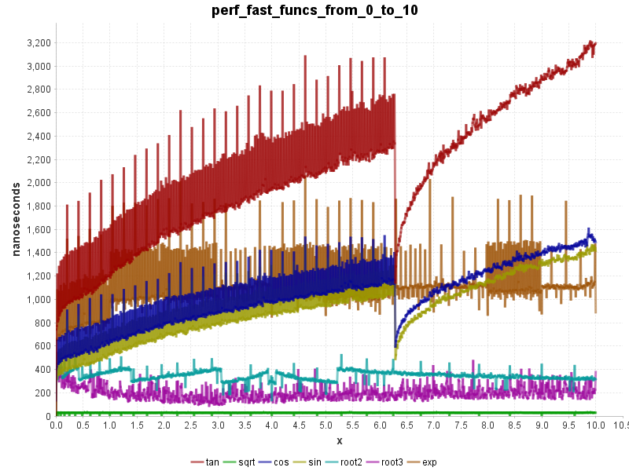
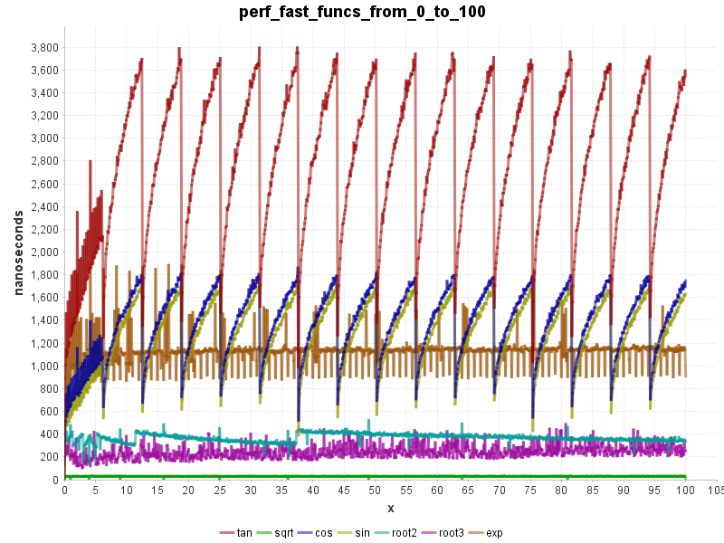
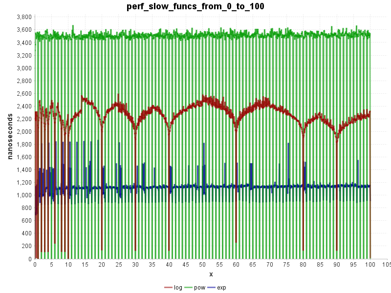

[](https://travis-ci.org/eobermuhlner/big-math)
[](https://codecov.io/gh/eobermuhlner/big-math)
[]()
[](https://search.maven.org/#search%7Cga%7C1%7Cbig-math)


# big-math

Advanced Java math functions (`pow`, `sqrt`, `log`, `sin`, ...) for `BigDecimal` using arbitrary precision.

## Overview BigDecimalMath

This implementation provides efficient and accurate implementations for:

*   `log(BigDecimal, MathContext)`
*   `exp(BigDecimal, MathContext)`
*   `pow(BigDecimal, BigDecimal, MathContext)` calculates x^y
*   `sqrt(BigDecimal, BigDecimal, MathContext)`
*   `root(BigDecimal, BigDecimal, MathContext)` calculates the n'th root of x

*   `sin(BigDecimal, MathContext)`
*   `cos(BigDecimal, MathContext)`
*   `tan(BigDecimal, MathContext)`
*   `asin(BigDecimal, MathContext)`
*   `acos(BigDecimal, MathContext)`
*   `atan(BigDecimal, MathContext)`

*   `sinh(BigDecimal, MathContext)`
*   `cosh(BigDecimal, MathContext)`
*   `tanh(BigDecimal, MathContext)`
*   `asinh(BigDecimal, MathContext)`
*   `acosh(BigDecimal, MathContext)`
*   `atanh(BigDecimal, MathContext)`

*   `pow(BigDecimal, int, MathContext)` calculates x^y for `int` y
*   `factorial(int, MathContext)` calculates n!
*   `bernoulli(int)` calculates Bernoulli numbers

*   `pi(MathContext)` calculates pi to an arbitrary precision
*   `e(MathContext)` calculates e to an arbitrary precision

*   `mantissa(BigDecimal)` extracts the mantissa from a `BigDecimal` (mantissa * 10^exponent)
*   `exponent(BigDecimal)` extracts the exponent from a `BigDecimal` (mantissa * 10^exponent)
*   `integralPart(BigDecimal)` extract the integral part from a `BigDecimal` (everything before the decimal point) 
*   `fractionalPart(BigDecimal)` extract the fractional part from a `BigDecimal` (everything after the decimal point)

## Documentation

For calculations with arbitrary precision you need to specify how precise you want a calculated result.
For `BigDecimal` calculations this is done using the `MathContext`.

```java
MathContext mathContext = new MathContext(100);
System.out.println("sqrt(2)        = " + BigDecimalMath.sqrt(BigDecimal.valueOf(2), mathContext));
System.out.println("log10(2)       = " + BigDecimalMath.log10(BigDecimal.valueOf(2), mathContext));
System.out.println("exp(2)         = " + BigDecimalMath.exp(BigDecimal.valueOf(2), mathContext));
System.out.println("sin(2)         = " + BigDecimalMath.sin(BigDecimal.valueOf(2), mathContext));
```
will produce the following output on the console:
```
sqrt(2)        = 1.414213562373095048801688724209698078569671875376948073176679737990732478462107038850387534327641573
log10(2)       = 0.3010299956639811952137388947244930267681898814621085413104274611271081892744245094869272521181861720
exp(2)         = 7.389056098930650227230427460575007813180315570551847324087127822522573796079057763384312485079121795
sin(2)         = 0.9092974268256816953960198659117448427022549714478902683789730115309673015407835446201266889249593803
```

Since many mathematical constants have an infinite number of digits you need to specfiy the desired precision for them as well:
```java
MathContext mathContext = new MathContext(100);
System.out.println("pi             = " + BigDecimalMath.pi(mathContext));
System.out.println("e              = " + BigDecimalMath.e(mathContext));
```
will produce the following output on the console:
```
pi             = 3.141592653589793238462643383279502884197169399375105820974944592307816406286208998628034825342117068
e              = 2.718281828459045235360287471352662497757247093699959574966967627724076630353547594571382178525166427
```

Additional `BigDecimalMath` provides several useful methods (that are plain missing for `BigDecimal`):
```java
MathContext mathContext = new MathContext(100);
System.out.println("mantissa(1.456E99)      = " + BigDecimalMath.mantissa(BigDecimal.valueOf(1.456E99)));
System.out.println("exponent(1.456E99)      = " + BigDecimalMath.exponent(BigDecimal.valueOf(1.456E99)));
System.out.println("integralPart(123.456)   = " + BigDecimalMath.integralPart(BigDecimal.valueOf(123.456)));
System.out.println("fractionalPart(123.456) = " + BigDecimalMath.fractionalPart(BigDecimal.valueOf(123.456)));
System.out.println("isIntValue(123)         = " + BigDecimalMath.isIntValue(BigDecimal.valueOf(123)));
System.out.println("isIntValue(123.456)     = " + BigDecimalMath.isIntValue(BigDecimal.valueOf(123.456)));
```
will produce the following output on the console:
```
mantissa(1.456E99)      = 1.456
exponent(1.456E99)      = 99
integralPart(123.456)   = 123
fractionalPart(123.456) = 0.456
isIntValue(123)         = true
isIntValue(123.456)     = false
```

For the mathematical background and performance analysis please refer to this article:
*	[BigDecimalMath](http://obermuhlner.ch/wordpress/2016/06/02/bigdecimalmath/)

Some of the implementation details are explained here: 
*	[Adaptive precision in Newton’s Method](http://obermuhlner.ch/wordpress/2016/06/07/adaptive-precision-in-newtons-method/)

## Development

To use the library you can either download the newest version of the .jar file from the
[published releases](https://github.com/eobermuhlner/big-math/releases/)
or use the following dependency to
[Maven Central](https://search.maven.org/#search%7Cga%7C1%7Cbig-math)
in your build script (please verify the version number to be the newest release):

### Use in Maven Build
```xml
<dependency>
    <groupId>ch.obermuhlner</groupId>
    <artifactId>big-math</artifactId>
    <version>1.0.0</version>
</dependency>
```

### Use in Gradle Build
```gradle
repositories {
  mavenCentral()
}

dependencies {
  compile 'ch.obermuhlner:big-math:1.0.0'
}
```

## Performance

The following charts show the time needed to calculate the functions over a range of values with a precision of 300 digits.








